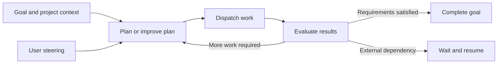

# EnoughFactory product build plan

EnoughFactory is a web application with Electron desktop bundles and a service on each Mac or Linux device. It starts as a polished interface to envmux, grows into a connected workspace for agent development, and then adds coordination and autonomous goal execution. Each layer extends the same product and remains useful as the next layer is built.

The first deliverable is the envmux workbench. A future instruction to build the full product covers all six layers below; finishing the workbench does not finish that instruction. Make routine implementation decisions, complete focused verification, and continue through the stack without requesting approval between layers.

## Product decisions

- React and EnoughUI supply the shared web interface. Electron is the desktop shell. Mac and Linux are required; Windows is optional.
- A small device service owns environments, runtime connections and device-local history. Window lifetime does not own execution lifetime.
- Envmux supplies the first environment engine. Start with a pinned, narrowly patched release; preserve its MIT notices and keep the adapter replaceable.
- EnoughFactory owns its container runtime. Bundle the OSS host tools and Docker Engine with a private socket, configuration, images, volumes and storage. On Mac, use a private Lima VM with Apple virtualization; on Linux, use a dedicated rootless engine. The product must not use the user's default Docker socket, change Docker contexts or take over an existing daemon. Report host prerequisites and workspace-provider capabilities explicitly.
- Agent processes receive full filesystem, process and network access inside their containers. Root access and tool installation are available there. Do not substitute a restricted runtime sandbox or a provider's automatic reviewer for this mode.
- Enough owns approval policy. Approve all is the initial factory setting; selective rules and manual review are available choices. Approval policy and autonomy are separate controls.
- WebRTC is the preferred remote transport. Local connections use the same application protocol without WebRTC. Self-hosted signaling and relay services support remote connectivity.
- Chats stay on their owning device. An offline device makes its chats and live tools unavailable; the interface retains ownership and last-known status.
- Autonomous goals have durable application state. A model finishing a turn does not terminate the factory's responsibility to the goal.
- ArtifactFS becomes a repository workspace provider alongside ordinary Git. Scheduling, goal state and evidence manifests have separate storage.
- Core product functionality, protocol definitions, adapters and setup are OSS and self-hostable. Users choose and authorize their agent/model dependencies.

## Delivery layers

| Layer | Product delivered | Main interface | Focused verification |
| --- | --- | --- | --- |
| 1 Envmux workbench | A useful desktop app for isolated development sessions | Projects, sessions, services, output, terminals and previews | Start a real session, inspect it, reconnect the UI and recover its changes |
| 2 Agent workspace and policy | Native agent chats with Enough-owned execution and approvals | Conversation, activity, permission mode, input and artifacts | Run full-access agent work and exercise the supported typed approval paths |
| 3 Connected devices | One workspace across Mac, Linux and browser clients | Devices, remote sessions, availability and pairing | Connect peers, exercise relay connectivity and reconnect a stream |
| 4 Coordinated work | Persistent tasks, placement, isolated attempts and integration | Work board, dependencies, attempts, changes and checks | Coordinate dependent work, recover one interruption and reject stale authority |
| 5 Autonomous factory | A durable loop that plans, executes, evaluates and improves a goal | Goal workspace, autonomy, progress, decisions and intervention | Run a goal through repair or replanning and reach its completion criteria |
| 6 Product delivery | Installable, documented, coherent OSS product | Onboarding, settings, diagnostics and consistent final flows | Check packaged Mac/Linux journeys and one complete factory scenario |

Build usable development bundles from Layer 1. Layer 6 completes distribution and integration; it is not the first time the app can be opened. Keep the normal build and type checks throughout, and use the focused behavior above when its implementation becomes real.

## Layer 1 Envmux workbench

### The first app experience

The user adds a local Git repository, sees its environment setup, creates a session and works in it through one window. The app shows image preparation and startup clearly. Once ready, it presents running services, their output, terminals and an application preview. Session stop returns work through envmux's existing Git flow; the resulting branch and changes are easy to find.

Use an EnoughUI Sidebar for projects and sessions, a compact session header for state and primary actions, and Resizable panels for the central work area. Session tabs expose Overview, Activity, Terminal, Preview and Changes. Keep project setup and settings in drawers or dedicated views. Show real loading, empty and failure states from the beginning.

Use EnoughUI's paper/ink surfaces, fine rules, square geometry and existing typography. Product controls and structured activity remain proportional; actual terminals and code views retain the typography needed for their function. The app should already feel like EnoughFactory, including offline fonts, keyboard navigation and deliberate spacing.

### Runtime integration

The device service initially acts as a thin envmux bridge. It owns session processes and brokers the existing state API, event streams, task output and terminal connections. Its small catalog holds project paths, display preferences and references to sessions. Envmux remains the authority for environment state; there is no goal scheduler or duplicate task ledger at this layer.

The device service also starts and recovers the private container runtime. Every envmux, agent, workspace and check operation receives its explicit owned endpoint and bundled client. Missing runtime assets or an unavailable private socket produce a setup state; they must never fall back to the user's Docker. The UI shows preparation, readiness, resource limits, failure details and explicit start/stop actions. Stopping the runtime while environments are active requires an explicit stop-environments action. Closing a window leaves the runtime and work running.

Keep Mac VM host shares limited to EnoughFactory-owned workspace and runtime directories; ordinary repository import and returned Git work remain host operations. The initial pinned guest OS image may be fetched on first start with verified digests and visible progress. Linux rootless setup uses its own engine and socket while retaining root permissions inside containers; any host UID-mapping prerequisites are explained in setup. ArtifactFS requires its trusted mount manager: enable it only on runtimes verified to support those mounts, and retain ordinary Git workspaces on other runtimes.

Envmux already exposes state/events, task output/logs, task controls, session controls, agents, chat and a shell WebSocket. The shared React client uses a typed Enough interface over those operations, rather than embedding the old portal as the product UI. Desktop native operations go through a narrow preload bridge; the web client connects to the device service's authenticated local API. [Existing portal routes](https://github.com/envmux/envmux/blob/38914dd0fb49682a062dc17eb3427f6b4f27c5fe/src/Envmux/Portal/PortalHost.cs#L265).

Make only the envmux changes required for a clean wrapper:

1. Add structured startup output for readiness, phases, endpoints and termination. Carry private bootstrap credentials through the service's private child-process channel; do not discover readiness by parsing human prose.
2. Add structured session discovery using existing container labels and persisted metadata, plus structured configuration errors where needed.
3. Give independent terminal tabs independent terminal identities while retaining reconnectable tmux attachment.
4. Expose narrow repository-status/diff operations only if the existing interface cannot supply the Changes view.
5. Fix platform behavior that blocks the actual Mac/Linux session journey.

Do not rewrite envmux into TypeScript or build a general orchestration service to make the first screen work. Keep its source patch small and documented so it can be rebased or contributed upstream.

### Integrated previews and lifetime

Electron previews use separate WebContentsView instances and session partitions. They receive no factory IPC or Node bridge. Preserve container-localhost semantics through an explicitly authorized session proxy client. Electron Chromium cannot simply inherit envmux's external-browser launch and SOCKS authentication assumptions; resolve this seam as part of the first preview implementation. Handle HTTP, WebSocket upgrades, cookies and redirects through the same session route. [Electron view API](https://www.electronjs.org/docs/latest/api/web-contents-view), [envmux browser routing](https://github.com/envmux/envmux/blob/38914dd0fb49682a062dc17eb3427f6b4f27c5fe/src/Envmux/Socks/BrowserLaunch.cs#L71).

Closing a workbench window detaches the client. Explicit session stop owns teardown. The device service has its own lifetime, startup and shutdown behavior, so later fleet connectivity does not require moving execution out of a renderer. Show session state from the engine and distinguish a lost connection from a stopped environment.

Layer 1 is complete when the real project/session journey works through the EnoughUI app, with useful terminal/output/preview access and recoverable Git results. It is a product milestone, not a mock interface or a distributed-factory demonstration.

## Layer 2 Agent workspace and app policy

Add genuine Codex and Antigravity conversations inside the existing session workspace. Retain Claude Code compatibility where envmux already supplies it. Runtime adapters cover start, events, input, interruption, supported resume, usage, artifacts and approval requests. Pin runtime versions and generate their protocol types where supported.

The interface adds conversation tabs, composer/input controls, structured tool activity, artifacts and clear runtime states. A user can begin work, watch it, steer it and interrupt it without opening another vendor application. Transcripts and runtime context are stored by the owning device service. Resuming a conversation uses the provider's supported mechanism; starting a replacement is explicit when its process or context cannot be restored.

### Full container execution

Approve all launches runtimes with their supported full-access configuration and no native human approval wait. For Codex non-interactive execution, the current concrete route is `codex exec --json --dangerously-bypass-approvals-and-sandbox`. Rich chat uses app-server's local protocol and full-access thread/turn settings. Generate types from the pinned binary because documentation examples and runtime enums can differ. [Codex full access](https://learn.chatgpt.com/docs/agent-approvals-security), [app-server](https://learn.chatgpt.com/docs/app-server).

Full permissions apply to the container. Agents can install dependencies, run commands, create services, use the network and change all files available there. The host's Docker socket and personal filesystem do not become part of the container merely because the agent has full access. If a project needs additional services or devices, the environment definition provisions them deliberately.

Project credentials and allowed integrations follow the selected goal/project policy. Approve all can authorize repository writes, merges, publication and deployment when those capabilities are configured. Do not add an obligatory human gate for those actions. Keeping credentials or effects behind an app integration must not become a hidden denial policy.

### Enough approval ownership

The policy service is part of Enough's device/coordinator application, not the Electron window. It continues when the UI closes. It receives typed requests from runtime adapters and produces schema-correct responses. Preserve the runtime request identity, action, arguments, attempt identity and policy revision, then record the decision and outcome.

| Policy | Behavior |
| --- | --- |
| Approve all | Accept supported requests automatically and immediately; record the decision without waiting for a window or person |
| Rules | Evaluate the project's configured rules or automated policy; route only unresolved decisions to the app |
| Manual | Present typed pending requests in Enough and return the user's decision to the waiting runtime |

The manual interface provides a concise explanation, relevant command/diff and the effects being authorized. It lives in the same workspace and can be reopened from an inbox. Late decisions for retired attempts are ignored. The device service retains the live runtime connection, so reconnecting a client does not lose a pending request.

Use official bidirectional interfaces for interactive decisions. Codex exec's JSON output is not an approval-response protocol; use app-server when that interaction is required. Antigravity's SDK supplies policy handlers; its CLI supplies a full-permission headless route. Keep full workspace access explicit when composing SDK policy handlers. Do not parse approval questions from terminal text. [Antigravity policies](https://www.antigravity.google/docs/sdk/policies/), [CLI headless mode](https://www.antigravity.google/docs/cli/headless/).

Selective policy governs the typed requests an adapter actually exposes. Full-access Codex does not promise a preflight request for every command. Represent adapter capabilities in the interface; a rule requiring interception the adapter cannot provide is unsupported, rather than silently guaranteed. Switching policy applies to new turns or replaces the runtime when its configuration cannot change live.

| Adapter route | Approval coverage |
| --- | --- |
| Codex exec with bypass | Full execution without an interactive decision channel |
| Codex app-server | Typed command, file and permission requests when the configured runtime raises them; no universal interception of every effect |
| Antigravity CLI with skip permissions | Full execution without streaming approval responses |
| Antigravity SDK | Tool policy callbacks with Enough responses; effects performed inside an allowed command are not separate callbacks |
| Existing envmux Claude runner | Full headless execution through its existing skip-permissions route; add a separately verified bidirectional adapter before claiming selective coverage |

The interface exposes these capabilities in policy settings. Approve all works through full execution or immediate callback acceptance; selective mode must never claim that every filesystem or network effect receives an independent decision.

For the pinned Antigravity SDK, enable all tools and explicit subagent capabilities, leave the SDK command sandbox disabled, and compose its full-access allowance with the Enough decision handler. Wildcard approval callbacks alone do not remove its workspace containment. Allocate Enough request IDs where native IDs are absent, and invalidate pending callbacks when their runtime or attempt is retired. [SDK policy implementation](https://github.com/google-antigravity/antigravity-sdk-python/blob/main/google/antigravity/hooks/policy.py#L762), [tool capabilities](https://github.com/google-antigravity/antigravity-sdk-python/blob/main/google/antigravity/types.py#L191).

Treat genuine questions, authentication requirements, quota waits and runtime failures as different events. In autonomous mode, the supervisor answers questions using the goal and project context or selects a next action. Provider sign-in and account constraints remain onboarding/runtime conditions rather than being mislabeled as Enough approval decisions.

## Layer 3 Connected devices with WebRTC

Add device pairing and remote access to the existing service API. A session keeps the same identity and interface regardless of the device owning it. The sidebar can show all paired projects and sessions, with ownership, availability and last-seen state. A disconnected chat says which device must return; it does not appear deleted or falsely stopped.

WebRTC connections live in the device service. Electron uses its local service; the browser client uses browser WebRTC or authenticated web transport. Start with `node-datachannel`/`libdatachannel` in the service because the package advertises Mac/Linux x64 and ARM64 support. Keep it behind a transport interface and settle packaging and reconnect behavior when this layer is implemented. [Native package](https://github.com/murat-dogan/node-datachannel).

Use self-hostable WSS signaling for peer discovery and negotiation, with STUN/TURN configuration for connectivity. The signaling service exchanges presence, offers, answers and ICE candidates; it does not own conversations or goals. Coturn supplies an optional relay when direct connections fail. Keep the shared credential-issuance secret on the service; clients receive only temporary TURN credentials. [WebRTC signaling](https://webrtc.org/getting-started/peer-connections), [coturn authentication](https://github.com/coturn/coturn/blob/master/README.turnserver).

Pair long-lived device identity keys through an invitation flow. Authenticate negotiation and bind it to the enrolled peer and DTLS fingerprint before granting control. WebRTC encryption by itself is not device enrollment. Reuse the same request/event envelopes over local transport, RTC and a configurable authenticated WSS relay fallback. [WebRTC security model](https://www.rfc-editor.org/rfc/rfc8827.html).

### Browser and remote previews

WebRTC data channels transport requests; they do not supply browser-navigable HTTP URLs. The viewing device's service therefore exposes an authenticated preview gateway and tunnels HTTP/WebSocket traffic to the session-owning peer. This serves the shared web app on an installed device as well as Electron. A browser client without a local service can use the same gateway on an explicitly configured self-hosted endpoint.

Give each preview an isolated origin: per-preview loopback hostnames for local access, or separate HTTPS preview hostnames for the self-hosted gateway. Keep factory credentials out of preview origins. Route cookies, redirect locations and WebSocket upgrades to the correct session, and provide the public preview origin to supported development servers. A service that hardcodes container-localhost URLs needs an explicit compatible configuration; arbitrary JavaScript cannot be made portable by rewriting a response header.

Use an external preview tab when a site's frame policy prevents embedding. The desktop session browser remains available for applications requiring full container-localhost browsing. Preserve the same session identity, availability and navigation controls whichever viewing surface is used.

Keep control, streams and bulk transfer in separate bounded application queues. Terminal and event streams carry cursors; artifact and Git bundle transfers use chunks, hashes and resumable offsets. Apply backpressure so a large transfer or slow viewer does not block control. These channels still share network congestion. [Data-channel specification](https://www.w3.org/TR/webrtc/).

Chats remain device-local. Replicate only the catalog metadata needed to find them; do not build transcript synchronization. Existing authorized work continues through a connection loss according to its execution policy. Cancellation remains requested until the owning service acknowledges it.

Verify this layer with one bounded connectivity exercise: direct connection, relay connection, sleep/network-change reconnect, terminal streaming beside an artifact transfer, and UI closure while work continues. Do not turn that exercise into a new networking platform.

## Layer 4 Coordinated work and repository handoffs

Introduce the first real factory state: tasks, dependencies, execution attempts, candidate changes, checks and integration. One selected service coordinates a goal; other devices execute its work. This authority is separate from signaling. A sleeping coordinator suspends new coordination, while live workers can finish already-authorized work and journal their results. Choose an always-on owned device when continuous operation matters.

Store coordination records transactionally, initially in SQLite at the coordinator. Worker services maintain local journals. A task keeps its identity across placements; each execution has its own attempt identity and authority generation. Avoid automatic multi-master coordination and database-file synchronization.

The Work interface presents the plan as useful tasks and dependencies, current owners, blockers and attempt history. Changes and checks remain attached to the session/conversation that produced them. Placement is visible when useful rather than becoming the main product vocabulary.

Use Git commits/bundles for candidates and immutable object manifests for screenshots, logs and check results. Cache candidate content at the integration authority before accepting it. Chat history can remain unavailable while its device is offline without making task state or integrated source depend on that history.

Add ArtifactFS as an actual workspace provider inside the Linux runtime environment, with ordinary Git workspaces as the compatible fallback. The trusted runtime manager owns mounting; a native Mac FUSE installation is not a prerequisite. Every author attempt receives its own writable workspace. Verification uses exact candidate inputs rather than filesystem status heuristics. [ArtifactFS](https://github.com/cloudflare/artifact-fs).

Coordinate author work in parallel where it is independent. Run relevant checks and integrate through a serialized queue, rechecking the combined result when its base changes. The configured policy can automatically accept and merge successful work. Record operator edits so relevant check results become stale when the candidate changes.

On disconnect, mark status unknown and reconcile; do not infer failure and duplicate arbitrary external effects. Retiring an attempt permits a replacement. Reject late authority, recover unknown effect outcomes before retrying, and preserve useful work. Integration/publication through Enough checks current goal and attempt authority; direct external credentials cannot provide that same fencing guarantee and must be represented honestly in policy and cancellation status.

## Layer 5 Autonomous goals and improvement

The factory application drives continuation. It does not rely on one long-running agent to remember to keep going or to self-schedule every next turn.

The coordinator persists each transition and invokes the appropriate agent for planning, implementation, diagnosis or evaluation. When a run ends, it decides whether to dispatch remaining work, repair a failure, revise the plan, integrate a candidate, wait for an external condition or complete the goal. An idle session or a polite final answer is not the stop condition.

Define project autonomy independently of approval policy:

- **Manual:** the user starts work and decides the next step.
- **Assisted:** Enough proposes next work and executes the work the user selects.
- **Autonomous:** Enough plans, makes implementation decisions, coordinates agents, repairs failures, improves the plan and continues toward the goal. Human approval is governed by the separate policy setting.

Autonomous plus Approve all is the full factory mode. It supports automatic planning, execution, reviews, integration and configured release actions. Human review is optional. Evaluation can use deterministic checks, independent agent judgment and product scenarios appropriate to the goal; avoid mandatory role ceremonies or repeated review of every minor change.

The Goal workspace shows the objective, current plan, accepted behavior, outstanding work and the next meaningful action. Its decision history explains major changes and repairs. The user can steer the objective, add context, change policy, pause, cancel or take over a task from the same interface. Display facts and concrete progress rather than fabricated completion percentages.

Persist context summaries and important decisions separately from provider transcripts so the factory can continue on a replacement runtime. Scope changes have an explicit plan revision. Progress detection should identify repeated failures or equivalent work, then change approach, model or decomposition where configured. Waiting releases inference and resumes from durable state; it should not become a periodic loop that spends tokens saying nothing changed.

Completion comes from the goal's configured criteria. Time, spend and concurrency budgets are explicit configurable controls, not hidden reasons to declare success or keep asking the user to continue. Cancellation stops new dispatch and revokes current authority; the interface preserves the difference between revocation and confirmed remote termination.

## Layer 6 OSS distribution and complete experience

Finish the product across the same web client, Electron bundles and headless device service. Required distribution targets are Apple Silicon Mac and Linux x64/ARM64; add Intel Mac where the chosen bundled dependencies support it. Windows remains optional.

Ship onboarding for the bundled private runtime, repository setup, provider connection, device pairing and a first session/goal. Bundle the required application runtimes and fonts so users do not need development SDKs or their own Docker installation to open the app. Package Mac Lima/virtualization and Linux rootless engine assets with pinned provenance and required notices. Expose useful connection, session and agent diagnostics in the app.

Provide install/service startup and removal, versioned migrations, release provenance, dependency notices, contributor setup, example projects and self-hosted signaling/TURN instructions. Signing and notarization use available credentials; otherwise label the unsigned build accurately. Define an explicit OSS license for Enough code and retain envmux, EnoughUI and other upstream notices.

Complete real loading/error/offline behavior and accessibility as part of each feature, then perform one final visual and interaction pass across the assembled app. Keep low-level diagnostics available without turning the normal interface into process logs.

## Implementation structure

Use one TypeScript workspace for the React application, Electron shell, device service and shared contracts. Envmux stays a pinned C# engine with a narrow patch set. WebRTC and agent runtimes sit behind adapters. Avoid a framework-heavy plugin system before those concrete adapters exist.

| Package or directory | Responsibility |
| --- | --- |
| apps/web | Shared EnoughUI workspace and browser entry |
| apps/desktop | Electron windows, previews and native handoff |
| apps/device | Local service, process supervision, peers and policy |
| packages/contracts | Typed requests, events and identifiers |
| packages/envmux | Engine lifecycle/API adapter |
| packages/agents | Codex, Antigravity and compatible runtime adapters |
| packages/runtime | Owned container engine, private socket, lifecycle and bundled runtime assets |
| packages/factory | Coordination and autonomy introduced in Layers 4 and 5 |
| packages/workspaces | Git and ArtifactFS workspace providers |
| services/signaling | Self-hosted peer negotiation and presence |
| vendor/envmux | Pinned upstream source and minimal patches |

Introduce packages when their layer needs them. The first workbench does not require empty implementations for the complete factory. Share contracts and transport interfaces early enough that remote access and autonomy extend existing operations.

## Verification and continuation

Verification should establish that the feature works and protect boundaries whose failure would corrupt work. Use normal builds/type checks, one representative journey for each newly delivered capability, and focused automated coverage for state transitions, ownership, cancellation or policy routing where it provides real value.

Do not write tests that mirror component markup, re-test EnoughUI internals or create exhaustive suites for reversible UI edits. Do not repeat broad checks after they pass unless new changes or a concrete failure justify it. Fix a failed check, run the relevant check again, and continue implementation.

At product completion, run one integrated scenario across the assembled stack: launch the app, pair devices, create an autonomous goal, dispatch real agents in full-permission containers, route an approval through Enough policy, recover an interruption, integrate work and satisfy the goal. Add a focused packaging check on each required OS. This is final verification of the product; it is not the first milestone.

A full-product goal proceeds through all layers autonomously. Keep progress updates concise and record material decisions. Ask only for genuinely missing information or access that prevents useful progress; continue independent work while it is pending. Do not pause at layer boundaries to seek confirmation, and do not stop at a UI wrapper when the instruction calls for the complete factory.
