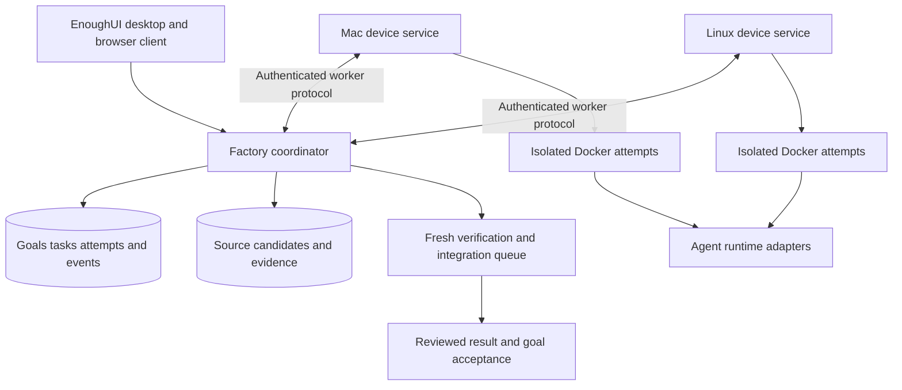

# enough-dev investigation and proposed direction

Investigated October 5, 2026. This report evaluates envmux, current agent collaboration systems, ArtifactFS, EnoughUI, and the two previous factory attempts. It proposes a direction for an open source factory running across owned Mac and Linux devices. The recommendations are design judgments; they have not been validated by running the proposed system.

**Agreed direction:** build a polished React/EnoughUI workbench over envmux first, using Electron desktop bundles and a shared web client. Add agent execution and app-owned policy, connected devices, coordination and autonomous goals in layers. Device services own execution; WebRTC connects them. Chats may remain unavailable while their owning device is offline. Agents receive full permissions inside their containers, with approval decisions owned by Enough. The [product build plan](/Users/russell/code/enough-dev/docs/build-plan.md) defines the delivery sequence and supersedes the earlier proving milestone.

The product promise should be: give the factory a goal, inspect its plan and progress, steer work, and review a verified result. Devices and agent products become execution choices within that experience.

## Scope and assumptions

The initial target is one owner with several intermittently available devices, macOS and Linux support, and isolated Docker workloads. Windows can follow. “Premium” is interpreted as quality, coherence and reliability, while the factory itself remains OSS. Multi-user permissions and hosted operations should remain possible without becoming the first release's infrastructure burden.

Source inspection and existing validation records establish what these projects implement or claim to have tested. This investigation did not run envmux sessions, mount filesystems, authenticate providers, start cloud jobs, or reproduce the previous factory failures. The existing projects were left unchanged. No implementation was started in enough-dev.

## What envmux can contribute

Envmux has substantial working-session machinery: container environments, branch-based work, saved task output, shells, a portal and container-aware browsing. Its main README describes a Windows beta, but the newer `v0.1.0-rc.1` publishes Windows, Linux x64/ARM64 and Apple Silicon Mac archives. The release states that live Docker and chef checks passed on Windows; interactive Mac testing remains the purpose of the RC. Native archives do not establish full platform acceptance. [Main README](https://github.com/envmux/envmux), [RC release](https://github.com/envmux/envmux/releases/tag/v0.1.0-rc.1).

The strongest reusable mechanisms are:

- **Repository transfer and recovery.** Git bundles move source into a session and return commits. Divergent branches retain the result for recovery. This avoids directly mounting the workstation checkout into an agent. [Workspace implementation](https://github.com/envmux/envmux/blob/38914dd0fb49682a062dc17eb3427f6b4f27c5fe/src/Envmux/Session/Workspace.cs#L15).
- **Retained sessions.** Named volumes preserve workspace and home state; task processes and output can be inspected through tmux and logs. Cleanup conservatively retains dirty or unreadable work. These are useful patterns to preserve even if the public session model changes. [Session lifecycle](https://github.com/envmux/envmux/blob/38914dd0fb49682a062dc17eb3427f6b4f27c5fe/src/Envmux/Session/Session.cs#L1619).
- **Observation separated from process input.** The portal exposes task output separately from interactive shells. Multiple attachments can reconnect to a named shell. This is a good basis for keeping agent execution independent of UI attachment. [Task launcher](https://github.com/envmux/envmux/blob/38914dd0fb49682a062dc17eb3427f6b4f27c5fe/src/Envmux/Session/SessionTask.cs#L507), [portal](https://github.com/envmux/envmux/tree/38914dd0fb49682a062dc17eb3427f6b4f27c5fe/src/Envmux/Portal).
- **Narrow orchestration authority.** Chef dispatch, guest chat and browser control use separate capabilities. Dispatch is repository-scoped and bounded, and workers do not inherit chef authority. [Chef endpoints](https://github.com/envmux/envmux/blob/38914dd0fb49682a062dc17eb3427f6b4f27c5fe/src/Envmux/Portal/PortalHost.cs#L220).

Its coordination currently stays local. Docker endpoints reject remote TCP and SSH; detached agents are tracked with local JSON records, host process IDs and stop files. The kitchen worker command is Claude Code; Codex can act as chef, but Codex and Antigravity are not interchangeable worker adapters. Tool credential copying is separate from installing and supporting each runtime. [Endpoint rules](https://github.com/envmux/envmux/blob/38914dd0fb49682a062dc17eb3427f6b4f27c5fe/src/Envmux/Backends/DockerEngine/EngineEndpoint.cs#L126), [agent registry](https://github.com/envmux/envmux/blob/38914dd0fb49682a062dc17eb3427f6b4f27c5fe/src/Envmux/Agents/AgentRegistry.cs#L85), [worker command](https://github.com/envmux/envmux/blob/38914dd0fb49682a062dc17eb3427f6b4f27c5fe/src/Envmux/Agents/AgentPrompt.cs#L33).

Linux deserves an early live spike. RC browser discovery and connection-owner authentication cover Windows and Mac, leaving Linux gaps. Container access to the host's loopback-bound coordination listener also appears questionable under native Linux bridge networking; this is an inference from source, not a reproduced failure. Release checks disable live Docker/Golden/E2E coverage. [Browser discovery](https://github.com/envmux/envmux/blob/38914dd0fb49682a062dc17eb3427f6b4f27c5fe/src/Envmux/Socks/BrowserLaunch.cs#L71), [connection authentication](https://github.com/envmux/envmux/blob/38914dd0fb49682a062dc17eb3427f6b4f27c5fe/src/Envmux/Socks/ConnectionOwner.cs#L31), [release workflow](https://github.com/envmux/envmux/blob/38914dd0fb49682a062dc17eb3427f6b4f27c5fe/.github/workflows/release.yml#L73).

**Reuse decision:** prototype envmux behind an Enough-owned worker interface before committing to a fork or extraction. Its MIT license supports reuse with retained notices, but its internals are application types rather than a supported library API. A CLI wrapper can establish behavior quickly; a persistent service will require deliberate lifecycle changes. Avoid a language rewrite simply to match the desktop shell. [License](https://github.com/envmux/envmux/blob/38914dd0fb49682a062dc17eb3427f6b4f27c5fe/LICENSE).

## Lessons from current teams and factories

| Reference | Current evidence | Implication for enough-dev |
| --- | --- | --- |
| Claude Agent Teams | Experimental interactive sessions with local tasks, mailboxes and file locks. Current docs say non-interactive print mode and Agent SDK sessions do not spawn teammates; session recovery has limitations. | Treat teams as a collaboration capability within an attempt. Enough owns fleet scheduling, durable task identity and recovery. [Docs](https://code.claude.com/docs/en/agent-teams) |
| StrongDM and Attractor | StrongDM describes an internal factory using specifications and behavioral scenarios. Published Attractor contains natural-language specifications for graph workflows, checkpoints, parallel stages and human gates. | Borrow inspectable workflows and independent acceptance. The published spec is not a ready-made device fleet. [Factory account](https://factory.strongdm.ai/), [Attractor spec](https://github.com/strongdm/attractor/blob/fb57a55/attractor-spec.md) |
| OpenAI Symphony | Engineering preview with a working Elixir coordinator, issue polling, bounded concurrency, retries and isolated workspaces. Current source includes optional SSH workers and host capacity. Coordinator claims and retry state remain in memory. | Strong reference for scheduler and worker separation. Durable restart recovery and portable artifacts remain work for Enough. [Spec](https://github.com/openai/symphony/blob/be10a1b79df723d6d7612b5651c8522704dafb2e/SPEC.md), [host scheduling](https://github.com/openai/symphony/blob/be10a1b79df723d6d7612b5651c8522704dafb2e/elixir/lib/symphony_elixir/orchestrator.ex#L1281) |
| OpenHands Agent Canvas | React control center, external ACP agent support, local/remote/cloud backends and per-conversation Docker isolation with retained workspaces and history. | Useful experience and adapter reference. Supporting several backends does not establish automatic goal-driven placement across them. [Repository](https://github.com/OpenHands/OpenHands/tree/ea2e6dfd694642210ce31a02231904f42fb03308), [ACP agents](https://docs.openhands.dev/openhands/usage/agent-canvas/acp-agents) |
| Dagger | Container workflow engine, typed functions, caching and remote engine connections. | Evaluate for reproducible checks after the basic factory loop works. Enough still owns placement, attempts and acceptance. Pin a coherent version because current docs mix beta and older deployment material. [Engine reference](https://docs.dagger.io/reference/cli/#dagger-engine) |

Anthropic's February 5, 2026 compiler experiment is also relevant: 16 agents, separate Docker workspaces and repository task locks. The account explains that agents converging on an indivisible failure limited useful parallelism. Better verification made independent work possible. This supports investing in task boundaries and feedback before raising agent counts. It does not establish a general unattended factory. [Engineering account](https://www.anthropic.com/engineering/building-c-compiler).

StrongDM's holdout scenarios and service twins suggest separating the agent's development tests from acceptance evidence. For Enough, start with meaningful deterministic checks and representative product scenarios. An agent's claim that it finished, a green tool exit, or an approved PR should each represent one stage rather than the whole goal.

## What the previous attempts teach

The local projects are useful evidence of failure and intent. Their historical restrictions, taxonomies and preferred infrastructure should not become enough-dev requirements.

`local-factory` implements a cooperative ledger for Codex chats sharing one checkout. Its revision/epoch fencing, outbox, cancellation and evidence rules are valuable, but its specification explicitly excludes a general agent runtime and container adapters. Retained records show worker creation and continuation blocked by desktop tool approval transport. File-based coordination could preserve intent but could not supply the missing execution capability. [Specification](/Users/russell/code/local-factory/SPEC.md:39), [historical continuation denial](/Users/russell/code/local-factory/projects/enough-approve/continuation-denial.json:6).

`cf-git-factory` has more actual runtime machinery: Cloudflare attempt environments, local snapshot/restore and PTY proofs, delivery adapters, independent checks and acceptance. Its README and proof log distinguish those from unproved live cloud inference, credential refresh, autonomous PR cycles and successor planning. The implementation is not merely empty scaffolding, but it has not demonstrated the complete loop. [README](/Users/russell/code/cf-git-factory/README.md:18), [proof log](/Users/russell/code/cf-git-factory/docs/BOOTSTRAP_PROOFS.md:7).

One concrete experience problem is especially important: CF terminal access requires an idle attempt and occupies the same active command state as the worker; disconnect or expiry can stop the entire environment. Enough should separate execution lifetime, observation attachment and deliberate writable intervention. Opening a preview or closing the app must not end an agent's work. A writable shell can alter the candidate and must be recorded accordingly. [Attempt admission](/Users/russell/code/cf-git-factory/tools/factory/src/attempt.ts:43), [terminal cleanup](/Users/russell/code/cf-git-factory/tools/factory/src/terminal.ts:125), [existing analysis](/Users/russell/code/cf-git-factory/docs/ENVMUX_INSIGHTS.md:15).

Carry forward durable intent before external effects, recovery of unknown outcomes, evidence pinned to exact source, separate functional dependencies and scheduling barriers, and irreversible cancellation. Replace shared-checkout file ownership with isolated attempt workspaces and an integration queue. Keep feature/unit taxonomy and model policies configurable. The historical learnings also show why passing author tests cannot stand in for integrated product acceptance. [Learnings](/Users/russell/code/local-factory/LEARNINGS.md:5), [delivery recovery](/Users/russell/code/cf-git-factory/tools/factory/src/application/fleet.ts:239).

Neither prior checkout currently has a LICENSE file. Their code is owner-controlled reference material; an OSS successor needs an explicit license and retained upstream notices before distribution.

## ArtifactFS and the three kinds of state

Cloudflare ArtifactFS is an Apache-2.0 beta filesystem for quickly exposing Git repositories and hydrating contents on demand. The local `virtual-repo` project is the RepoReach fork of it. ArtifactFS uses Git metadata, SQLite snapshots/overlays and a blob cache; it does not supply fleet scheduling, distributed ownership, replication or a general evidence store. [Upstream](https://github.com/cloudflare/artifact-fs), [local foundation](/Users/russell/code/virtual-repo/README.md:13).

Its best fit is a **workspace provider**: prepare a large repository at an exact source revision without downloading all file contents up front. Every attempt still needs a private writable workspace. Candidate extraction and verification must use actual Git changes and exact source identities, independently of provider convenience fields.

| State | Recommended first implementation | Purpose |
| --- | --- | --- |
| Factory authority | Transactional database and durable event/outbox records on the coordinator | Goals, plan revisions, tasks, attempts, leases, budgets, cancellation and acceptance |
| Source and candidates | Git commits and bundles; clone/worktree provider first, ArtifactFS provider optional | Exact inputs, private changes, recoverable candidate handoffs and integration |
| Evidence and context | Immutable objects plus manifests, initially coordinator disk with optional object-storage adapter | Logs, test receipts, screenshots, summaries, preview recordings and context packages |

The ArtifactFS mount path has an isolation cost. The local container example needs a FUSE device and elevated mount capabilities; native Mac use currently requires a separately approved macFUSE kernel backend. Existing RepoReach records report real Linux ARM64 mount tests but explicitly leave real macOS mount acceptance unperformed. [Container example](/Users/russell/code/virtual-repo/examples/cloudflare-sandbox-sdk/container_src/mount-artifact-fs-repo.sh), [validation boundary](/Users/russell/code/virtual-repo/docs/reporeach/validation.md:34).

**Recommendation:** normal Git workspaces should be enough to start. Spike ArtifactFS within the Linux runtime VM as an optional acceleration path. Compare initialization, common build/test workloads, Git behavior, total transferred bytes and restart recovery. Do not grant every coding agent broad mount privileges merely to reduce startup time. ArtifactFS snapshotting does not move a running process or its memory to another device.

## Proposed distributed architecture

This is a proposed architecture, not a claim about an existing implementation.

### One coordinator and independent device services

Start with one authoritative coordinator, preferably on an always-on Linux device. It can run on a Mac for a single-machine installation, but sleeping that Mac also suspends coordination. Closing its UI should not stop its service. Other devices execute work, cache artifacts and report events through an authenticated protocol.

Workers should initiate connections and claim eligible work. Pairing grants each device a revocable identity. The first connectivity target can be a reachable LAN or existing private network; outbound connections alone do not solve NAT when the coordinator is unreachable. Internet relay hosting can be a later optional adapter.

A single durable SQLite database on the coordinator is a reasonable initial design judgment. It must have backup/export and explicit single-writer ownership. Worker-local journals spool output and effect receipts through disconnects. Do not synchronize database files between machines or invent automatic leader election for the first version. Coordinator failover can be added after restart and recovery behavior is proven.

### Goals and deterministic execution

Use the progression **goal → versioned plan → tasks → attempts → candidates → verification → integration → accepted behavior**. A task retains its identity when placement changes; every replacement execution gets a new attempt identity.

An agent can propose a plan, discover dependencies and request further work. A deterministic controller validates those proposals against policy and budgets, persists them, and dispatches work. Agents need useful bounded operations, not unrestricted mutation of factory state. Separate scheduling constraints from functional dependencies.

Placement should consider architecture, available CPU/memory/disk, runtime availability, provider credentials and permitted repositories. Device counts do not imply independent model quotas: limits may be shared by account. Quota waits should stop inference and release compute when safe, preserving enough context to continue later. Initial policies should bound concurrency, elapsed time, inference spend, retries and artifact retention.

### Recovery and cancellation

Execution delivery will have repeated messages and unknown outcomes. Use stable operation IDs, durable intent and reconciliation rather than assuming exactly-once agent execution.

Each attempt receives a lease and fencing generation. Lease expiry prevents its results from becoming authoritative. A disconnected worker may still consume compute, so the device must enforce a local deadline and policy for loss of contact. Old results can be retained as evidence without silently integrating them. A replacement attempt reconstructs from committed source, checkpoint artifacts and an explicit context package; it does not pretend to resume a process that no longer exists.

Cancellation revokes future work durably and rejects stale completions. Enough integrations can check current goal and attempt generations before canonical pushes, PR publication and deployments, automatically allowing configured actions under Approve all. Direct publication credentials do not provide the same fencing guarantee. Remote stop requests are best effort until acknowledged; the UI should distinguish requested cancellation from confirmed process termination. Pending external effects need observation before retry or cleanup. Unknown outcomes are a visible state.

### Verification and integration

Authors return candidate commits and manifests. Validation runs in a fresh workspace, with evidence bound to candidate source, base revision, acceptance contract and environment. Independence should come from the workspace and checks; using another agent product alone does not prove it.

Serialize factory-managed integration into a canonical branch. The integration service checks current attempt authority and updates the expected base atomically. When its base changes, retest the combined tree and invalidate affected evidence. Two independently green patches can still conflict behaviorally. Goal completion requires product acceptance on the integrated result. Approval policy can automatically authorize integration, publication and deployment; those stages do not inherently require human review.

### Isolation and credentials

Device services own the Docker API. Agents receive full permissions inside isolated containers, including filesystem, process and network access. Full container access does not require mounting the host Docker socket or personal filesystem. Enough owns approval policy and routes typed runtime requests, automatically accepting them under Approve all. Logs and artifacts need redaction and retention rules. Provider credentials should be managed through supported authentication paths and should stay out of checkpoint images.

Docker provides useful process and resource isolation, but its daemon and configuration remain sensitive boundaries. The first deployment target can be trusted personal development with hardened containers; accepting hostile public jobs would require a stronger isolation design. [Docker security model](https://docs.docker.com/engine/security/).

Use a Docker-compatible runtime interface. Linux can use Docker Engine; Mac needs a Linux runtime environment. Colima/Lima offer an OSS route, while users may already have Docker Desktop. Support detection and guided setup rather than forcing one vendor. Publish ARM64 and x86_64 images where providers support them; do not assume emulation has native performance. [Colima](https://github.com/abiosoft/colima), [Lima](https://github.com/lima-vm/lima), [multi-platform images](https://docs.docker.com/build/building/multi-platform/).

## Agent integration and the OSS boundary

The factory should own a small versioned adapter contract: runtime discovery, start, events, terminal result, supported resume, interruption, permission requests, usage and artifact references. Preserve native events alongside normalized events so adapters do not erase useful diagnostics or invent capabilities.

**Codex:** a non-interactive execution adapter offers the narrowest proving path. App-server provides richer bidirectional interaction through local stdio, but current docs mark the command and WebSocket transport experimental and unsupported for production workloads. Keep it behind a replaceable adapter, pin versions and avoid using its listener as the fleet protocol. [Non-interactive mode](https://learn.chatgpt.com/docs/non-interactive-mode), [app-server](https://learn.chatgpt.com/docs/app-server).

Current Sign in with ChatGPT documentation provides an eligible OSS/local-app authentication route, including distinct stable host identifiers for a laptop and self-hosted VM, and using the authorized token with Codex app-server. That is a promising account experience to validate. Paid or remotely hosted eligibility has a separate path. Keep API-key execution as an explicit supported option; do not design around extracting another application's credential cache. [OSS plan usage](https://developers.openai.com/siwc/token-sharing-open-source), [Codex integration](https://developers.openai.com/siwc/token-sharing-open-source/codex-app-server).

Those provider host identifiers do not authenticate Enough devices. Enough needs its own device identities and revocation. Current transferred-session support also lacks host-specific usage attribution and individual VM revocation, so fleet controls cannot assume provider tokens have the same scope as execution leases. [Self-hosted VM limitations](https://developers.openai.com/siwc/token-sharing-open-source/self-hosted-vms).

**Antigravity:** current official docs now support headless CLI execution, JSON and streaming events, conversation continuation and programmatic input. This changes older assumptions that it is only an IDE integration. Gemini API-key authentication is documented for headless/CI use and requires explicit provider configuration. Actual pinned Docker packaging, interruption and refresh behavior still need validation. [Headless execution](https://www.antigravity.google/docs/cli/headless/), [installation and auth](https://www.antigravity.google/docs/cli/install/).

A successful agent response is not evidence that all required tools ran or that the requested change works. Antigravity documents soft-denied tools even in successful runs. Enough's result model must distinguish runtime completion, candidate production, validation and acceptance. [Headless result semantics](https://www.antigravity.google/docs/cli/headless/).

The public Antigravity Python SDK provides useful approval and lifecycle interfaces. Its published distributions include a compiled local harness whose source was not found in the public SDK repository during this investigation. Treat that as an unresolved build-from-source boundary, even though distribution metadata carries an Apache license. Keep the adapter optional if the OSS promise extends to every runtime dependency. [SDK source](https://github.com/google-antigravity/antigravity-sdk-python), [versioned distributions](https://pypi.org/project/google-antigravity/0.1.20/).

**OSS delivery:** all factory-owned code, protocol definitions, setup and core functionality should be open and self-hostable. Agent tools and model services can be optional user-selected dependencies with their own terms. Do not promise that every supported provider is reproducible from public source. Establish the Enough license, contributor documentation, dependency notices, portable fixtures and adapter conformance tests before release. Test core scheduling without paid accounts, then offer opt-in real-provider acceptance checks.

## The EnoughUI product experience

EnoughUI already provides the React primitives for this product: navigation, commands, resizable panels, dialogs, forms, attachments, messages and scrolling. The actual consumer package is `@enoughtools/ui-react`; the local package is version 0.4.0 with MIT licensing and React 19 peers. Specialized terminals, diff review, editors, repository trees and task graphs require additional integrations. [Package](/Users/russell/code/enough-ui/packages/react/package.json:1), [exports](/Users/russell/code/enough-ui/src/index.ts:3).

Its paper/ink surfaces, square geometry, fine rules, proportional controls and serif headings support a calm workspace. Use those existing tokens and components. Self-host fonts for offline operation and retain notices. The library's proportional typography rule should not force a terminal emulator into broken proportional columns; give raw developer tools a deliberate application treatment. [Styles](/Users/russell/code/enough-ui/src/styles/styles.css:9), [brand assets and fonts](/Users/russell/code/enough-ui/docs/assets/brand/README.md:7), [library instructions](/Users/russell/code/enough-ui/AGENTS.md:1).

The normal experience should organize information around five needs:

1. **Goal:** objective, acceptance criteria, plan and the next meaningful decision.
2. **Work:** progress, dependencies, blockers and attempt history, with device placement available when relevant.
3. **Review:** proposed changes, checks, screenshots and live previews attached to the exact candidate.
4. **Devices:** pairing, availability, capacity, runtime readiness and drain/pause controls.
5. **Activity:** durable events and agent conversation, with a clear route back to the task or evidence concerned.

Continuous progress should come from durable task and evidence records. Conversation provides context. A reopened app should show the same goal and verified candidate, even if its original agent session is gone. Avoid invented percentage completion; show accepted requirements and outstanding work.

**Platform recommendation:** desktop-first delivery over a portable web client and independent services. A browser client plus installed device services is also viable. The reason to prefer a desktop front door is the requested unified experience: guided local onboarding, native credentials and notifications, repository handoff and integrated previews. Headless Linux workers should not require a GUI. Keep the browser client as a full alternative for monitoring, review and steering, and compare that baseline with both desktop shells.

**Shell decision:** Electron provides the desktop bundles, with WebContentsView for integrated previews. The costs include larger distribution and memory use. Generated previews need separate sandboxed contents with no Node access, factory IPC or credential bridge. Browser automation should run with the worker environment rather than with authority in the control UI. [WebContentsView](https://www.electronjs.org/docs/latest/api/web-contents-view), [security guidance](https://www.electronjs.org/docs/latest/tutorial/security).

Tauri remains background research rather than an implementation decision to reopen. Its sidecars and OS webviews could serve a thinner shell, but Electron is the agreed choice for this product. [Sidecars](https://v2.tauri.app/develop/sidecar/), [capabilities](https://v2.tauri.app/security/capabilities/).

## The first product milestone

Deliver the envmux workbench: add a project, configure and start an isolated session, inspect services and output, use terminals and previews, reconnect the UI and find the returned Git changes. Use the real engine behind a polished EnoughUI interface.

Then add agent conversations and app-owned policies, WebRTC devices, coordinated tasks, autonomous goals and final distribution in the sequence defined by the [build plan](/Users/russell/code/enough-dev/docs/build-plan.md). Carry UI and UX forward with every layer. Focused verification accompanies implementation; a complete factory scenario belongs at final integration rather than defining the first milestone.

Full autonomy is an app behavior: persist and choose the next action after each agent turn until the goal criteria are satisfied, an explicit pause/cancel occurs, or an external dependency requires waiting. Approve all can execute configured release actions automatically. Multi-master coordination, live process migration, Kubernetes and mandatory native FUSE installation remain outside the initial architecture.

## Evidence provenance

Envmux was inspected at main `fea308284adf5f6a67630a30910b9646b1aee18d` and RC `38914dd0fb49682a062dc17eb3427f6b4f27c5fe`. Symphony was inspected at `be10a1b79df723d6d7612b5651c8522704dafb2e`; OpenHands at `ea2e6dfd694642210ce31a02231904f42fb03308`; Attractor at `fb57a55`.

Local base revisions were `local-factory` `c12e553ecb9c5b7b67bf9b27118cee7996126a3d`, `cf-git-factory` `d36a4c6dd7375bee3eca961500f84c8563e9c2ff`, `enough-ui` `2c0a5f41ceb589b19224dd3f06f5345a14b2a0cd`, and `virtual-repo` `2ef65a402a7cba301cca55fecbc5c7a05c4c9532`. Local evidence also included uncommitted files, so these revisions alone do not reproduce every inspected document. Historical proof records are cited as records rather than new test results.
